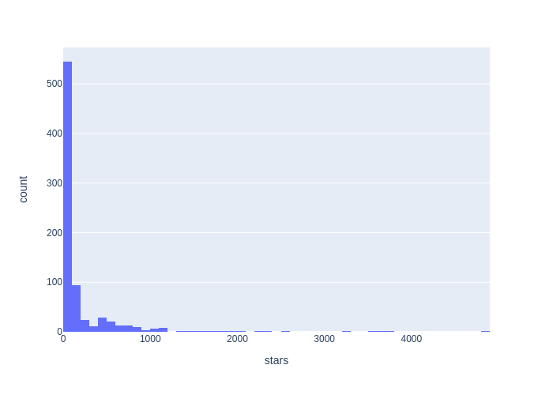

# Most Popular Programming Languages in Bioinformatics

> **Programming language dominance in bioinformatics seems to closely follows methodological shifts in the field.**
> **Python’s rise reflects its central role in modern data-driven and AI-enabled biology.**

<video src="https://github.com/user-attachments/assets/67364e34-0a33-4d55-9ac6-063bd92fb29c" width="352" height="720" type="video/mp4"></video>
Figure 1 : Most popular (most starred) programming languages in Bioinformatics from 2008 to 2025. No data available from 2008 to 2013

<video src="https://github.com/user-attachments/assets/ac869678-a5fd-4077-bf90-baaaee9cae53" width="352" height="720"  type="video/mp4"></video>
Figure 2 : Topics strongly associated with Bioinformatics from 2008 to 2025. No data available from 2008 to 2013

## Overview

This repository analyzes **how programming language popularity in bioinformatics has evolved from 2008 to 2025**.

Using public GitHub repositories tagged with bioinformatics-related topics, we track language usage over time, using GitHub stars as a proxy for popularity, and visualize trends with a bar chart race.

### Key Findings:

- 2008–2016: **Alongside C and Java, Perl and R were heavily used in practical bioinformatics workflows** (sequence parsing, scripting, and statistics), even if they were underrepresented in public GitHub repositories at the time.

- 2016-2017: Python adoption increased rapidly for pipeline development and automation, while **R remained central for statistical analysis and visualization**.

- 2018–present: **Python emerged as the dominant general-purpose language**, with R continuing to play a key role in omics analysis and C/C++ remaining important for performance-critical tools.

The **rise of Python** closely follows the **growth of machine learning, deep learning, and protein structure analysis**, supported by widely used libraries such as scikit-learn, PyTorch, TensorFlow, and Biopython.

### Why This Matters

Choosing a programming language in bioinformatics affects:

- Available **tools and libraries**
- **Development speed** and performance
- **Memory efficiency** and **maintainability**
- **Career relevance** and employability

While Python and R dominate today, historically the field has relied heavily on Fortran, C/C++, Java, and Perl. **Understanding how these shifts happened helps practitioners anticipate future trends**.

## Context

“One of the most common questions among bioinformatics practitioners is: Which programming languages are the most popular in bioinformatics?”
The choice of programming language strongly influences the available ecosystem of tools, libraries, and workflows, as well as practical considerations such as development speed, execution performance, memory efficiency, long-term maintainability, and even Career relevance and employability. All of these factors are critical when addressing research or industry problems.

Since the early 2000s, many bioinformatics-specific libraries have been developed for particular languages, including BioPerl [1], BioJava [2], and Biopython [3], which support the manipulation and analysis of DNA, RNA, and protein sequences and structures. From a career perspective, choosing languages that are widely used in the field is also important for employability and effectiveness.

Learning a programming language is non-trivial, as each language is designed around specific principles and assumptions. Python emphasizes readability and ease of use [4], R focuses on statistical computing and data analysis [5], C++ prioritizes low-level control and execution speed [6], and Perl is known for efficient text and string manipulation [7]. While these descriptions are simplifications—and many languages overlap in functionality—they provide useful intuition for understanding their original design goals.

Several publications have traced the historical development of bioinformatics and the role programming languages have played in its success [8–10]. These works highlight milestones such as early tools written in Fortran (e.g., Clustal), C (e.g., MUSCLE), R (e.g., Bioconductor), and Java (e.g., Jalview and BioJava), spanning from the late 1950s through the 2000s.

Based on these studies [8–10], blog posts [11–14], and even answers from modern chatbots, there is broad agreement that Python and R are currently the most popular programming languages in bioinformatics, without dismissing the continued relevance of C/C++, Java, or MATLAB. However, this raises an important question: Has this always been the case?
Looking back in time suggests that the ranking of popular languages has changed significantly, highlighting the importance of understanding how and why such shifts occur. Studying these dynamics can help practitioners better anticipate future trends.

## Method

This analysis contributes to understanding how programming language popularity in bioinformatics has changed over time. We propose a bar chart race [15] visualization that tracks language usage from 2008 to 2025.

The data were collected from public GitHub repositories using the GitHub Search API. Bioinformatics repositories were identified, and GitHub star counts were used as a proxy for popularity. In practice, repositories were selected using the following criteria:

- `stars:10..5000`. An upper bound of 5,000 stars was applied because one of the most highly starred bioinformatics repositories, Biopython, typically falls within the 4k–5k range. Plotly was excluded and treated as an outlier due to its substantially higher star count (~24k).

- `topic: bioinformatics`. Only repositories explicitly tagged with bioinformatics in their GitHub topics were included.

- `pushed: [year]-01-01..[year]-12-31`. The pushed field represents the date of the most recent commit. Years from 2008 to 2025 were selected to cover the full period of interest.

For each year, only the top 100 repositories ranked by star count were retained. Star distributions exhibit a long-tail pattern, where a small fraction of repositories accumulate most of the stars, while the majority have fewer than 50. Consequently, a limited number of repositories largely explains the observed popularity of programming languages. Including additional repositories is unlikely to significantly affect the cumulative star counts.

Figure 3 : Star histogram.

## Results

Programming languages that were widely used in bioinformatics decades ago are not necessarily the most popular today. This shift appears to reflect how the field of bioinformatics has evolved in relation to other research areas.

From 2008 to 2016, C and Java dominated bioinformatics repositories. In 2017, R became the most prominent language, followed by a clear shift toward Python from 2018 onward, a trend that continues today (See Figure 1).

This transition can be further explained by examining co-occurring topics within bioinformatics repositories. Between 2008 and 2016, dominant topics included genomics, BioJava, databases, and gene ontology. From 2016 to 2018, the focus expanded to genomics, RNA-seq, pipelines, sequencing, and workflows. Between 2018 and 2023, topics such as deep learning, machine learning, and computational biology became increasingly prominent. From 2023 to the present, repositories increasingly emphasize genomics, DNA, NGS, deep learning, sequence alignment, and protein structure (See Figure 2).

Python is the dominant language in machine learning, deep learning, and protein structure analysis, supported by widely adopted libraries such as scikit-learn, PyTorch, TensorFlow, and Keras. This strong connection to rapidly growing fields likely explains Python’s rise in bioinformatics. Notably, Biopython is currently the most starred GitHub repository associated with the “bioinformatics” topic.

## Conclusion

These results illustrate that predicting the next dominant programming language in bioinformatics is challenging. However, monitoring emerging trends, ecosystems, and cross-disciplinary connections can help identify promising languages and technologies.

This perspective aligns with broader analyses of global programming language trends, which show successive dominance of Fortran (1966–1979), Pascal (1980–1984), C (1984–2001), Java (2001–2008), C# (2008), Java (2012), JavaScript (2013), and Python (from 2018 onward).

## Limitations

- GitHub stars were used as a proxy for programming language popularity. While reasonable, this metric does not directly reflect repository quality or real-world usage. Some repositories with few stars may still be critically important within niche domains.

- Only the primary programming language of each repository was considered. This coarse-grained approach does not capture projects that rely on multiple languages.

- GitHub’s search API limits results to 100 repositories per query. While including only the 100 most starred repositories per year provides a reasonable approximation for identifying popular languages, more comprehensive data could improve statistical precision.

- GitHub launched in 2008, so code-sharing before that has no central hub, making it difficult to analyze trends in Bioinformatics prior to 2008.

- For a more complete picture, other data sources like Stack Overflow, publications, or job postings could be analyzed to capture developer activity and programming language usage.

## Thank you for your feedback 

BioStar forum :
- [Genomax](https://www.biostars.org/u/18713/)
- [Alex Reynolds](https://www.biostars.org/u/20/)
- [Rob](https://www.biostars.org/u/1149/)
- [Genomax](https://www.biostars.org/u/18713/)
- [Dr.Omics](https://www.biostars.org/u/152314/)
- [newbioinfograd2323](https://www.biostars.org/u/148483/)
- [Istvan Albert](https://www.biostars.org/u/2/)

## References

[1] https://bioperl.org/

[2] https://biojava.org/

[3] https://biopython.org/

[4] https://en.wikipedia.org/wiki/Python_(programming_language)

[5] https://en.wikipedia.org/wiki/R_(programming_language)

[6] https://en.wikipedia.org/wiki/C%2B%2B

[7] https://en.wikipedia.org/wiki/Perl

[8] Gauthier, J. et al. A brief history of bioinformatics. Briefings in Bioinformatics, 2019.

[9] Dudley, J. T., & Butte, A. J. A quick guide for developing effective bioinformatics programming skills. PLOS Computational Biology, 2009.

[10] Fourment, M., & Gillings, M. R. A comparison of common programming languages used in bioinformatics. BMC Bioinformatics, 2008.

[11] https://bioinfo.iric.ca/the-languages-of-bioinformatics/

[12] https://ghazalabioinfodr.medium.com/most-used-programming-languages-for-bioinformatics-b1b19cc297ea

[13] https://bioinformatics.ccr.cancer.gov/btep/r-or-python-which-should-i-learn/

[14] https://bioinformatics.ccr.cancer.gov/docs/intro-to-bioinformatics-ss2023/Lesson5/R_and_Python/

[15] https://github.com/dexplo/bar_chart_race